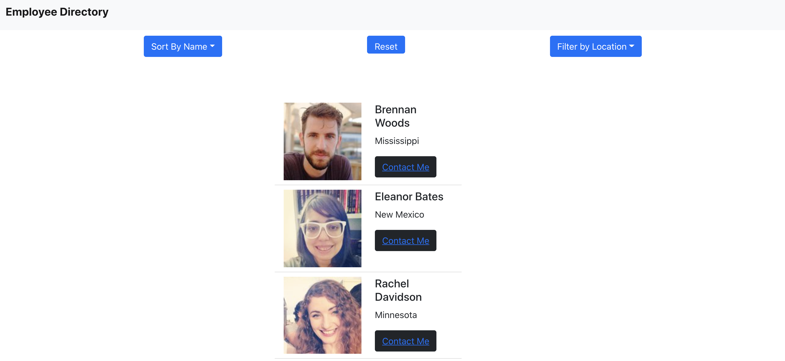

 # Employee-Directory-React 

   
  This application allows user to view a list of employees with basic unsensitive informationa and links. User can sort and filter users 

   

   [Deployed last version](https://quiet-beach-68881.herokuapp.com/)

   [Github repo](https://github.com/Amal31497/Employee-Directory-React)

   

  ## Table of Contents 
 
  ##### * [Technologies used](#Technologies)
  ##### * [Screenshots](#Screenshots)
  ##### * [Credits](#Credits)
  ##### * [License](#License)
  ##### * [Contact Info](#Contact)

  ## Technologies:
   _*HTML, CSS, Javascript, Heroku App, React, React Hooks*_

  ## Screenshots:
  
  
  ## Credits:
  [w3schools.com](w3schools.com)
   
  [reactjs.com](reactjs.com)

  ## License: 

  ##### Copyright: Amal Janabayev

  ##### 

  ##### [License Link](https://www.gnu.org/licenses/gpl-3.0.en.html)

  ## Contact: 

  ##### amalj2426@gmail.com
